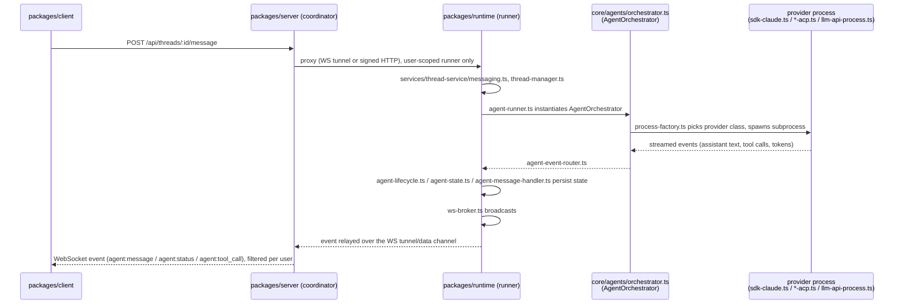

# How a live agent run actually executes

This traces what happens when a user sends a message to a thread in the running app (client + server + runner) — as opposed to the standalone issue-to-PR automation covered in [integrations/extensions-and-services.md](../integrations/extensions-and-services.md). Everything on this page lives in `packages/runtime`, `packages/core`, `packages/shared`, and `packages/client`; none of `packages/agent`, `packages/api-acp`, or `packages/harness` participate in it.

## Sequence

## Step by step, with files

1. **Client → Server.** The client sends a follow-up or new message through the REST API; `packages/server` is the single entry point for all client requests and owns persistent state (users, projects, threads, messages).
2. **Server → Runner.** The server proxies the request to the runner that belongs to the requesting user. **This routing is a hard security boundary** — a request is never routed to a different user's runner, even if that runner happens to be online. The one deliberate exception is *steer-share delegation* (see [domain/threads-and-worktrees.md](../domain/threads-and-worktrees.md)), which crosses this boundary only through a fixed route allow-list in `packages/server/src/middleware/proxy.ts`.
3. **Runner receives the request.** `packages/runtime/src/services/thread-service/messaging.ts` and `thread-manager.ts` handle the incoming message.
4. **Agent process is spawned.** `packages/runtime/src/services/agent-runner.ts` imports `AgentOrchestrator` and `defaultProcessFactory` directly from `@funny/core/agents` (`packages/core/src/agents/orchestrator.ts` — described in its own docstring as a "portable agent lifecycle manager" that owns process creation and start/stop/resume).
5. **Provider selection.** `AgentOrchestrator` asks `process-factory.ts` for a concrete process implementation based on the thread's configured provider: `sdk-claude.ts` for Claude, `codex-acp.ts` / `gemini-acp.ts` / `cursor-acp.ts` / `opencode-acp.ts` / `generic-acp.ts` for Agent-Client-Protocol CLIs, `deepagent-process.ts`, or `llm/llm-api-process.ts` for generic LLM-API providers. `generic-acp.ts` resolves its spawn command from `packages/shared/src/provider-manifest*.ts` (the pluggable provider-config system).
6. **Events flow back.** The spawned process streams assistant text, tool calls, and token counts back through `agent-event-router.ts`, gets persisted via `agent-lifecycle.ts` / `agent-state.ts` / `agent-message-handler.ts`, and is broadcast through `ws-broker.ts` — a singleton pub/sub broadcasting to all connected clients over a single multiplexed WebSocket stream (not one socket per thread). Every event carries a `threadId` so the client can route it to the right view.
7. **Terminal sessions** are a separate path: `pty-manager.ts` dispatches to one of several backends (`pty-backend-headless.ts`, `pty-backend-bun.ts`, `pty-backend-node-pty.ts`, `pty-backend-tmux.ts`, `pty-backend-daemon.ts`, `pty-backend-null.ts`) depending on platform/availability.
8. **Scheduled/triggered runs** go through `automation-manager.ts` / `automation-scheduler.ts` instead of a direct user message, and can invoke the pipeline layer described in [pipelines-and-automation.md](./pipelines-and-automation.md) for multi-step workflows.

## Thread modes and git operations

- **`local` mode** runs the agent directly in the project directory; **`worktree` mode** creates an isolated git worktree + branch per thread (`packages/core/src/git/worktree.ts`).
- All git operations funnel through `packages/core/src/git/process.ts` (`gitRead`/`gitWrite` concurrency pools, `execute` for general process spawning) — this is the one place cross-platform process execution and pooling happens.
- `packages/core/src/git/git.ts` holds the high-level operations (diff, stage, commit, push, branch management); `packages/core/src/git/github.ts` wraps the `gh` CLI for PRs.
- `packages/core/src/git/native.ts` optionally loads `@funny/native-git` (the Rust/`gitoxide` module) to accelerate status/diff/log/blame, falling back to the CLI-based path when the native addon isn't available for the current platform — parity between the two is checked by `packages/core/src/__tests__/git-native-parity.test.ts`.

## What changed vs. `CLAUDE.md`

`CLAUDE.md`'s description of this specific flow (agent-runner → core/agents → ws-broker, runner isolation, git through `core/git/process.ts`) is still accurate and is the basis for this page. The one addition it's silent on: `packages/runtime/src/services/pipeline-manager.ts` used to *be* the pipeline engine; it now delegates DAG execution to `@funny/pipelines`' `runPipeline` while keeping domain-specific glue (agent/git/approval actions) locally — see [pipelines-and-automation.md](./pipelines-and-automation.md).
