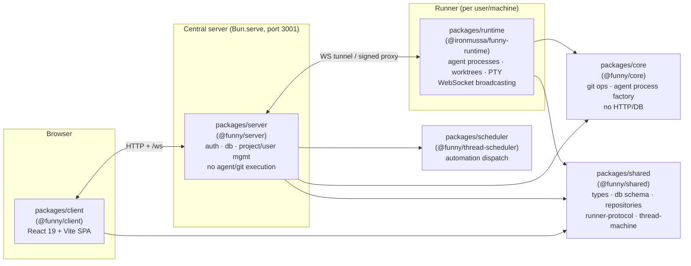

# Architecture overview

funny is a Bun workspaces monorepo (`workspaces: ["packages/*"]`, root `package.json:17-19`). The five packages the in-repo `CLAUDE.md` documents (`shared`, `core`, `runtime`, `server`, `client`) are still the backbone of the live product, but 14 more packages have been added since that file was last updated. This page is the ground-truth map — every row below was verified against each package's own `package.json`, README, and `src/` tree, not against `CLAUDE.md`.

## The live app (client → server → runner)

This is the same shape `CLAUDE.md` describes ("Client → Server → Runner", server owns persistent state, runner has no database of its own) — that part is still accurate. What's new: `packages/scheduler` now runs as **its own process** by default (`root package.json` `dev:scheduler` script, `concurrently -n server,runner,client,sched`) rather than living inside the server; it talks to the server over HTTP (`packages/scheduler/src/adapters/http-*.ts`) against `/api/scheduler/system/*` routes (`packages/server/src/routes/scheduler-system.ts`).

## Full package map

| Package | npm name | Role | Wired into the live app? |
| --- | --- | --- | --- |
| `packages/shared` | `@funny/shared` | Types, Drizzle DB schema, repositories, runner protocol, thread state machine, auth/roles. Depends on `@funny/evflow`. | Yes — imported by nearly every other package |
| `packages/core` | `@funny/core` | Pure logic: git ops (`git/`), agent process factories (`agents/`), scheduler primitives, container/Chrome DevTools support. No HTTP/DB code. | Yes — consumed by `agent`, `harness`, `reviewbot`, `runtime`, `scheduler`, `server` |
| `packages/runtime` | `@ironmussa/funny-runtime` | The "runner": Hono routes + services that spawn agent processes, manage worktrees/PTY sessions, broadcast WebSocket events. Published independently (`bunx @ironmussa/funny-runtime`). | Yes — this is the runner half of the server+runner split |
| `packages/server` | `@funny/server` | The central coordinator: Better Auth, Drizzle/Postgres or SQLite, users/projects/memberships, proxies agent/git/filesystem requests to runners. | Yes — the app's single entry point (`bin/funny.js`) |
| `packages/client` | `@funny/client` | React 19 + Vite SPA: chat UI, review pane, terminal, kanban, analytics, visualizer host. | Yes — the UI |
| `packages/scheduler` | `@funny/thread-scheduler` | Poll/reconcile loop for scheduled/automated thread dispatch, built on `@funny/core`'s scheduler primitives; runs as a standalone process talking to the server over HTTP. | Yes, as a separate process |
| `packages/pipelines` | `@funny/pipelines` | Generic DAG/workflow execution engine (JSONata expressions + Mustache templating). | Yes — `packages/runtime/src/services/pipeline-manager.ts` delegates its `runPipeline` calls here |
| `packages/workflows` | `@funny/workflows` | YAML-based workflow/pipeline definitions, graph builder, Zod schema. | Yes — `packages/runtime/src/pipelines/yaml-compiler.ts`, `packages/client/src/components/WorkflowsSettings.tsx`, `packages/scheduler/src/dispatcher.ts` |
| `packages/native-git` | `@funny/native-git` | Rust/NAPI-RS module (built on `gitoxide`/`gix`) accelerating git status/diff/log/blame/stash. | Yes, optionally — `packages/core/src/git/native.ts` loads it and falls back to the CLI-based implementation when unavailable |
| `packages/plugin-sdk` | `@funny/plugin-sdk` | Stable public contract for visualizer plugins (peer-dep `react>=19`). | Yes — the client's built-in Mermaid/CSV visualizers and third-party plugins both compile against this contract |
| `packages/evflow` | `@funny/evflow` | In-house TypeScript DSL for Event Modeling (commands/events/aggregates/sagas as code). | Yes, as an "architecture as code" artifact — `packages/shared/src/evflow.model.ts` encodes the funny domain with it and `packages/runtime/src/__tests__/services/evflow-model.test.ts` checks it in CI; not a runtime dependency of the running server |
| `packages/sdk` | `@funny/sdk` | Thin typed client for funny's ingest webhook API (`FunnyClient`). | Used by `agent`, `chrome-extension`, `reviewbot` to report back into funny — not imported by client/server/runtime itself |
| `packages/agent` | `@funny/orchestrator` | Standalone Hono service (default port 3002) that takes GitHub issues to merged PRs autonomously (plan → worktree → implement → PR → CI/review → merge). | **No** — no other package imports it; runs as its own process. Its own README documents several modules (`hatchet/`, `director.ts`, `watchdog.ts`, `circuit-breaker.ts`, `dlq.ts`, etc.) that do not exist yet in `src/` — treat that README's architecture diagram as aspirational, not current |
| `packages/api-acp` | `@funny/api-acp` | Standalone Hono service (default port 4010) exposing the Claude Agent SDK's `query()` as a run-based HTTP protocol. | Consumed only by `packages/agent` (registered as an LLM provider `funny-api-acp` at `http://localhost:4010`, `packages/agent/src/config/defaults.ts`) — not by `runtime`/`server`/`client` |
| `packages/harness` | `@funny/harness` | Experimental public SDK/facade for authoring agents/sessions/tools/workflows without importing the full server/runtime app. Wraps `@funny/pipelines` + `@funny/core`. | **No** — no other package imports it yet; explicitly "experimental" per its own README |
| `packages/reviewbot` | `@funny/reviewbot` | Standalone service: fetches a GitHub PR diff, sends it to the Anthropic API, posts a structured review via `gh pr review`. Reports results into funny's ingest API via `@funny/sdk`. | **No** in-repo consumers; distinct from the in-pipeline reviewer/corrector stages described in [pipelines-and-automation.md](./pipelines-and-automation.md) |
| `packages/memory` | `@funny/memory` ("Paisley Park") | Standalone project-memory system (semantic search, temporal decay, LLM consolidation) with its own REST API and MCP server. | **No** — no consumers found anywhere in client/server/runtime/core |
| `packages/chrome-extension` | `@funny/chrome-extension` | Chrome MV3 "UI Annotator" extension — select/annotate DOM elements on any page and send them to funny. | Standalone browser extension; shares only `packages/shared/src/dom/extract.ts` with the in-app Browser Annotator Panel |
| `packages/design-client` | `@funny/design-client` | "Open Design" — planned open-source clone of Claude Design for AI-driven visual prototyping. | **No** — spec-only (`docs/open-design.md`, `docs/decisions.md`), no `src/` yet |

## Other top-level components

- **`bin/funny.js`** — the all-in-one CLI. Parses `--port`, `--host`, `--team`, `--token`, `--secret`, `--local`, `--no-open`; runs either a standalone local app or a runner that enrolls with a central `@funny/server` via `--team <url>`. Also dispatches `funny ext …` subcommands for managing visualizer extensions.
- **`src-tauri/`** — a Tauri v2 desktop wrapper. `tauri.conf.json` sets `frontendDist` to the built `packages/client/dist` and bundles a sidecar binary (`externalBin: ["binaries/funny-server"]`) produced by `scripts/build-sidecar.ts`, so the desktop app runs the server as a subprocess.
- **`scripts/fitness/`** — automated architecture guardrails run in `bun run lint`/CI: layering (`server` can't import `runtime`; `core` can't import `hono`/`drizzle-orm`; `shared` can't import `core`/`runtime`), circular-import detection, file-size ceilings, and baseline-diff checks for TypeScript errors and unvalidated HTTP/JSON/query/socket boundaries (`scripts/fitness/check-*.ts`).
- **`docker/docker-compose.hatchet.yml`** — spins up a self-hosted Hatchet stack (Postgres, RabbitMQ, engine, dashboard). It is optional infrastructure for `packages/agent`'s durable/batch workflow mode only (`HATCHET_CLIENT_TOKEN`) — **not** used by `packages/scheduler` or `packages/workflows`, which are separate, in-house engines.

## Orphaned artifacts (do not regenerate blindly)

`domain.yaml`, `context-map.mmd`, and `graph.json` at the repo root are generated DDD artifacts whose header comments reference a `packages/domain-map` CLI tool. That package no longer exists — it was removed in commit `a0184e723` ("refactor: remove domain-map package (superseded by evflow)"). The three files are still git-tracked but nothing in the current repo (no script, package, or doc) regenerates or reads them; they predate the `packages/evflow` "architecture as code" approach described above. Don't treat them as current documentation.
