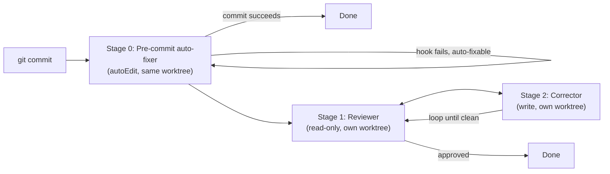

# Pipelines, review/fix stages, and automation

funny has two distinct "multi-step automation" systems that are easy to confuse. This page separates them.

## 1. The post-commit review/fix pipeline (in-app)

Documented in [`docs/architecture/pipeline.md`](../../docs/architecture/pipeline.md): an automated code review and fix loop that runs after every git commit inside a thread, using AI agents to review changes and iteratively fix issues.

**Key design principle:** every stage runs in its **own git worktree**, so multiple agents (and their review/fix stages) never collide on a checkout. Without this, a reviewer/corrector stage running against a parallel agent's shared working directory could apply a patch while that agent is still writing to it. Each stage thread is visible in the sidebar with its own status, and the parent thread keeps working while the pipeline runs in the background.

This pipeline is implemented via `packages/runtime/src/services/pipeline-manager.ts` and the pipeline-specific code under `packages/runtime/src/pipelines/` (`runner.ts`, `yaml-compiler.ts`, `yaml-loader.ts`, `approval.ts`, `types.ts`). Its own docstring states these pipelines "use the generic `@funny/pipelines` engine but define domain concepts (agents, git, commands) via the `ActionProvider` interface" — i.e., the DAG-execution mechanics (JSONata expressions, Mustache templating) live in `packages/pipelines`, and `packages/runtime` supplies the agent/git/command actions and approval gates on top.

Related runtime services: `git-pipelines.ts`, `pipeline-adapter.ts`, `git-workflow-service.ts`, `scheduler-pipeline-adapters.ts`, `pipeline-approval-store.ts`, `pipeline-prompts.ts`.

**This is distinct from `packages/reviewbot`.** `reviewbot` is a standalone webhook service that reviews already-opened GitHub PRs via the Anthropic API and posts a `gh pr review` — it is not referenced anywhere in `docs/architecture/pipeline.md` and nothing in the runtime pipeline imports it. See [integrations/extensions-and-services.md](../integrations/extensions-and-services.md).

## 2. Workflows and scheduled automation

- **`packages/workflows` (`@funny/workflows`)** defines YAML-based workflow catalogs (graph builder + Zod schema + serialize/parse). Consumed by `packages/runtime/src/pipelines/yaml-compiler.ts` / `yaml-loader.ts`, surfaced in the UI at `packages/client/src/components/WorkflowsSettings.tsx`, and used by `packages/scheduler/src/dispatcher.ts`.
- **`packages/runtime/src/services/automation-manager.ts`** and **`automation-scheduler.ts`** drive scheduled/triggered automations inside the runner, which can invoke the pipeline layer above for multi-step work.
- **`packages/scheduler` (`@funny/thread-scheduler`)** is the poll/reconcile "brain" for scheduled/automated thread dispatch. Its own code comment describes it as transport-agnostic: with in-process adapters it can run inside the server; with HTTP adapters (the current default — `packages/scheduler/src/adapters/http-*.ts`) it runs as its own process hitting `/api/scheduler/system/*` on the server. It's built on pure logic exported from `@funny/core/scheduler` (`planDispatch`, retry/backoff). Root `package.json`'s `dev:scheduler` script runs it alongside server/runner/client in development.

## Optional durable-workflow infra (not part of the above)

`docker/docker-compose.hatchet.yml` spins up a self-hosted Hatchet stack (Postgres, RabbitMQ, hatchet-engine, hatchet-dashboard on `:8080`). Hatchet is referenced only inside `packages/agent` (the standalone issue-to-PR service, gated by `HATCHET_CLIENT_TOKEN`) for its own durable/batch workflow mode — it is **not** used by `packages/scheduler`, `packages/workflows`, or the in-app pipeline above. Don't assume Hatchet needs to be running for normal thread automation.
