# Runner gRPC runbook

The server-to-runner path uses the native `runner.v2` gRPC protocol exclusively. There is no WebSocket, signed-HTTP, or direct-fetch fallback for runner traffic. Browsers continue to use HTTP and Socket.IO with the central server; they do not connect to `grpc-js` directly.

## Composition and ownership

```mermaid
flowchart LR
    Browser[Browser] <-->|HTTP + Socket.IO| Presentation[HTTP and Socket.IO handlers]
    Presentation --> Ports[RunnerRequestPort<br/>RunnerTerminalPort<br/>RunnerPresencePort]
    Events[accepted runner events] --> Sink[BrowserEventSink]
    Sink --> Browser
    Ports --> ServerAdapters[gRPC request, terminal,<br/>presence adapters]
    ServerAdapters --> Endpoint[runner.v2 endpoint<br/>session registry + dispatchers]
    Endpoint <-->|five authenticated streams| Transport[GrpcTeamTransport]
    Transport --> Runtime[runner domain services]
    Runtime --> Domains[thread · project identity<br/>automation policy clients]
```



The boundaries have one owner each:

- Server presentation code owns HTTP/Socket.IO semantics and depends only on `runner-ports.ts` interfaces.
- `RunnerGrpcSessionRegistry` is the sole authority for authenticated runner presence and session replacement.
- Tunnel and terminal dispatchers own framing, deadlines, cancellation, backpressure, and active-call limits. `GrpcRunnerRequestAdapter` is the translation into `RunnerRequestPort`.
- `BrowserEventSink` owns browser rooms. Its Socket.IO adapter sends accepted events once to the owner user room and shared-thread stream rooms.
- Runtime `team-client.ts` owns enrollment, connection lifecycle, and local caches. It does not own remote domain operations.
- `GrpcTeamTransport` composes control, operations, event, tunnel, and terminal adapters around one negotiated client. Domain data calls live in the thread, project-identity, and automation-policy clients over the shared remote data channel.

This adapter boundary is intentional: replacing gRPC should require new port implementations and composition changes, not edits across routes and Socket.IO handlers.

## Configuration

The runtime needs all three values in team mode:

```sh
TEAM_SERVER_URL=https://funny.example.com
RUNNER_GRPC_ENDPOINT=grpc.funny.example.com:443
RUNNER_AUTH_SECRET=<shared runner/server secret>
```

The central server enables and binds its dedicated HTTP/2 listener with `RUNNER_GRPC_ENABLED`, `RUNNER_GRPC_HOST`, and `RUNNER_GRPC_PORT`. Limits and liveness controls use the remaining `RUNNER_GRPC_*` values documented in `.env.example`. Public TLS/ALPN normally terminates at ingress; the server listener is private. A runtime with `TEAM_SERVER_URL` but no `RUNNER_GRPC_ENDPOINT` fails startup instead of falling back.

## Test layers

| Layer               | What it protects                                                       | Command                                                                            |
| ------------------- | ---------------------------------------------------------------------- | ---------------------------------------------------------------------------------- |
| Architecture        | Direction of dependencies, one registry, no legacy fallback            | `bun run fitness:runner-transport`                                                 |
| Adapter contracts   | Control, operations, events, tunnel, terminal, replay and cancellation | Focused runtime/server gRPC tests                                                  |
| Production vertical | Browser handler → ports → real gRPC → runtime and back                 | `bun test packages/server/src/__tests__/services/grpc-production-adapters.test.ts` |
| Cross-language      | Bun server interoperability with generated Rust Tonic client           | `bun run protocol:compat:harness`                                                  |
| Ingress             | TLS 1.2+, ALPN h2, trailers, deadlines, reconnect through Envoy        | `bun run protocol:compat:ingress`                                                  |
| Chaos soak          | Repeated disconnects, stalls, slow consumers, RSS and backlog bounds   | `bun run --cwd packages/runner-grpc-harness test:soak`                             |

Pull requests run the fast layers in `.github/workflows/runner-grpc.yml`; scheduled/manual CI runs the 20-minute soak.

## Diagnosis

1. Confirm the server gRPC listener is enabled and the runtime endpoint resolves to it. Do not point `RUNNER_GRPC_ENDPOINT` at the browser HTTP port unless ingress explicitly routes native HTTP/2 gRPC there.
2. Check the first control-stream failure. Invalid credentials, an unsupported protocol version, listener disablement, and session replacement are terminal setup failures; transient transport loss is reconnectable.
3. For request timeouts, trace the tunnel deadline/cancel result and confirm active tunnel count returns to zero. A completed request body may still have an in-flight local fetch that cancellation must abort.
4. For missing browser events, distinguish event acceptance/receipt from `BrowserEventSink` room publication. The owner uses `user:<id>`; sharees use `thread:<id>:stream`.
5. For slow-consumer incidents, run the sustained harness and inspect active-call backlog, peak RSS, RSS growth, status trailers, and forced reconnect counters. Backlog must be zero at shutdown.

Protocol or flow-control changes are incomplete until the Rust compatibility, production vertical, and sustained profiles pass. Deployment-specific ingress changes additionally require the ingress gate.
