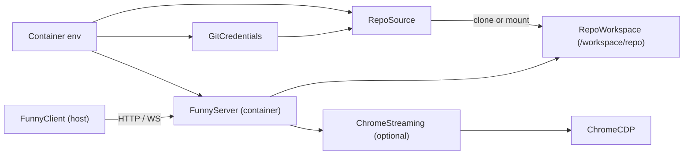

# @funny/podman-chrome-streaming

`@funny/podman-chrome-streaming` is now a Podman runtime for remote Funny development.

Its main job is:

- start the published `@ironmussa/funny-runtime` runtime inside the container
- prepare a git workspace by `clone` or `mount`
- support private repo auth with `GIT_TOKEN` or `GIT_TOKEN_FILE`
- expose a stable port so the Funny client can connect from outside the container
- optionally keep the Chrome streaming stack available for visual debugging

## Profiles

### `funny-remote`

Main use case:

- runtime enabled
- repo prepared inside container
- Funny server exposed to the host
- Chrome streaming optional

### `stream-only`

Compatibility mode for the original package:

- no repo setup
- no Funny server
- only Chrome + viewer + scripts

Use it with:

- `ENABLE_RUNTIME=false`
- `ENABLE_STREAMING=true`

## Launcher API

This package can also run a host-side launcher that starts Podman for you after a single HTTP request.

Start it locally:

```bash
cd packages/podman-chrome-streaming
bun run start:launcher
```

Default URL:

```text
http://127.0.0.1:4040
```

Available endpoints:

- `GET /health`
- `GET /status`
- `POST /start`
- `POST /stop`

### Example: start by request

```bash
curl -X POST http://127.0.0.1:4040/start \
  -H "Content-Type: application/json" \
  -d '{
    "repoMode": "clone",
    "repoUrl": "https://github.com/org/repo.git",
    "repoRef": "main",
    "workBranch": "feature/demo",
    "enableStreaming": true,
    "funnyPort": 3001
  }'
```

Example response:

```json
{
  "status": "ready",
  "container": {
    "containerName": "funny-remote",
    "imageTag": "funny-runtime:latest",
    "exists": true,
    "running": true,
    "state": "running",
    "machineIp": "172.25.137.72",
    "funnyUrl": "http://localhost:3001",
    "streamUrl": "http://localhost:3500",
    "novncUrl": "http://localhost:6080/vnc.html",
    "chromeDebugUrl": "http://localhost:9222",
    "funnyMachineUrl": "http://172.25.137.72:3001",
    "streamMachineUrl": "http://172.25.137.72:3500",
    "novncMachineUrl": "http://172.25.137.72:6080/vnc.html",
    "chromeDebugMachineUrl": "http://172.25.137.72:9222"
  }
}
```

### Example: stop by request

```bash
curl -X POST http://127.0.0.1:4040/stop \
  -H "Content-Type: application/json" \
  -d '{"containerName":"funny-remote","remove":true}'
```

## Architecture



## Processes inside the container

| Process | Responsibility | Enabled when |
|---|---|---|
| `runtime` | Resolve config, prepare repo, start `@ironmussa/funny-runtime` | `ENABLE_RUNTIME=true` |
| `xvfb` | Virtual display for Chrome | `ENABLE_STREAMING=true` |
| `chrome` | Chromium with CDP enabled | `ENABLE_STREAMING=true` |
| `x11vnc` | Exposes the virtual display as VNC | `ENABLE_STREAMING=true` |
| `novnc` | Browser VNC gateway | `ENABLE_STREAMING=true` |
| `streaming` | Stream viewer + automation UI | `ENABLE_STREAMING=true` |

## Prerequisites

### Linux / macOS

```bash
# macOS
brew install podman
podman machine init
podman machine start

# Ubuntu / Debian
sudo apt-get install -y podman
```

### Windows

```powershell
winget install RedHat.Podman
podman machine init
podman machine start
podman info
```

If Podman says it cannot connect, start the machine again:

```powershell
podman machine start
```

If `localhost` returns `Empty reply from server` on Windows, use the `machineIp` returned by the launcher:

```text
http://<machineIp>:3001
http://<machineIp>:3500
http://<machineIp>:6080/vnc.html
```

## Build

Build from the monorepo root, because the image needs multiple workspace packages:

```bash
podman build -t funny-runtime -f packages/podman-chrome-streaming/Containerfile .
```

### Recommended wrapper commands

This package includes wrappers that auto-start `podman machine` on Windows before running the real command.

Run them from `packages/podman-chrome-streaming`:

```bash
bun run podman:build
bun run podman:compose:up
```

Available helpers:

- `bun run podman:build`
- `bun run podman:run -- ...`
- `bun run podman:compose:up`
- `bun run podman:compose:down`
- `bun run podman:machine:start`

On Linux and macOS, these wrappers simply pass through to `podman` / `podman-compose`.

## Quick start

### 1. Clone a public repo

```bash
podman run -d \
  --name funny-remote \
  --replace \
  -p 3001:3001 \
  -p 3500:3500 \
  -p 3501:3501 \
  -p 6080:6080 \
  -p 9222:9222 \
  --shm-size=2g \
  --security-opt seccomp=unconfined \
  -e ENABLE_RUNTIME=true \
  -e ENABLE_STREAMING=true \
  -e REPO_MODE=clone \
  -e REPO_URL=https://github.com/org/repo.git \
  -e REPO_REF=main \
  -e FUNNY_PORT=3001 \
  funny-runtime
```

### 2. Clone a private repo with token

```bash
podman run -d \
  --name funny-private \
  --replace \
  -p 3001:3001 \
  -p 3500:3500 \
  --shm-size=2g \
  --security-opt seccomp=unconfined \
  -e ENABLE_RUNTIME=true \
  -e REPO_MODE=clone \
  -e REPO_URL=https://github.com/org/private-repo.git \
  -e REPO_REF=main \
  -e WORK_BRANCH=feature/test-in-container \
  -e GIT_TOKEN=ghp_xxxxxxxxxxxxxxxxxxxx \
  -e GIT_USERNAME=x-access-token \
  funny-runtime
```

### 3. Clone a private repo with mounted secret

`GIT_TOKEN_FILE` has priority over `GIT_TOKEN`.

```bash
podman secret create git_token ./git-token.txt

podman run -d \
  --name funny-private \
  --replace \
  -p 3001:3001 \
  -p 3500:3500 \
  --secret git_token \
  --shm-size=2g \
  --security-opt seccomp=unconfined \
  -e ENABLE_RUNTIME=true \
  -e REPO_MODE=clone \
  -e REPO_URL=https://github.com/org/private-repo.git \
  -e REPO_REF=main \
  -e WORK_BRANCH=feature/test-in-container \
  -e GIT_TOKEN_FILE=/run/secrets/git_token \
  -e GIT_USERNAME=x-access-token \
  funny-runtime
```

### 4. Mount a local repo from the host

```bash
podman run -d \
  --name funny-mounted \
  --replace \
  -p 3001:3001 \
  -p 3500:3500 \
  -v /host/path/repo:/workspace/repo \
  --shm-size=2g \
  --security-opt seccomp=unconfined \
  -e ENABLE_RUNTIME=true \
  -e REPO_MODE=mount \
  -e REPO_REF=my-existing-branch \
  -e FUNNY_PORT=3001 \
  funny-runtime
```

### 5. Stream-only mode

```bash
podman run -d \
  --name chrome-stream \
  --replace \
  -p 3500:3500 \
  -p 3501:3501 \
  -p 6080:6080 \
  -p 9222:9222 \
  --shm-size=2g \
  --security-opt seccomp=unconfined \
  -e ENABLE_RUNTIME=false \
  -e ENABLE_STREAMING=true \
  funny-runtime
```

## Smoke test

This launcher flow was validated end-to-end against a public repository and started the full runtime successfully.

### 1. Start the launcher

```bash
cd packages/podman-chrome-streaming
bun run start:launcher
```

### 2. Trigger a real runtime start

Use alternate host ports if you already have another Chrome streaming container running:

```powershell
$body = @{
  repoMode = "clone"
  repoUrl = "https://github.com/ironmussa/funny.git"
  repoRef = "master"
  workBranch = "feature/launcher-smoke-test"
  enableStreaming = $true
  funnyPort = 3101
  streamViewerPort = 3600
  streamWsPort = 3601
  novncPort = 6180
  chromeDebugPort = 9322
  containerName = "funny-remote-smoke"
} | ConvertTo-Json

Invoke-WebRequest -UseBasicParsing `
  -Method POST `
  -Uri http://127.0.0.1:4040/start `
  -ContentType "application/json" `
  -Body $body
```

### 3. Expected URLs

```text
Funny runtime: http://localhost:3101
Stream viewer: http://localhost:3600
noVNC:         http://localhost:6180/vnc.html
Chrome CDP:    http://localhost:9322
```

### 4. Expected health signals

- `podman ps` shows the container as `Up`
- `http://127.0.0.1:3600/health` returns `200`
- `http://127.0.0.1:3101/api/projects` may return `401` without auth, which still confirms that `@ironmussa/funny-runtime` is running

### Notes

- this example repository uses `repoRef=master`, not `main`
- local auth mode generates an auth token inside `FUNNY_DATA_DIR`
- if another container already uses `3500`, `3501`, `6080`, or `9222`, choose different host ports in the launcher request

## Connect the Funny client

After the container is running, point the Funny client to:

```text
http://localhost:3001
```

On some Windows + Podman Machine setups, `localhost` may be proxied unreliably by `wslrelay.exe`.
If that happens, use `funnyMachineUrl` from the launcher response instead.

If the client runs separately in dev mode, set `CLIENT_ORIGIN` so the container server allows cross-origin requests:

```bash
-e CLIENT_ORIGIN=http://localhost:5173
```

## Environment variables

### Runtime switches

| Variable | Default | Description |
|---|---|---|
| `ENABLE_RUNTIME` | `true` | Start repo setup + `@ironmussa/funny-runtime` |
| `ENABLE_STREAMING` | `true` | Start Chrome, viewer, noVNC and stream UI |

### Launcher

| Variable | Default | Description |
|---|---|---|
| `LAUNCHER_HOST` | `127.0.0.1` | Host address for the launcher HTTP API |
| `LAUNCHER_PORT` | `4040` | Port for `POST /start`, `POST /stop`, `GET /status` |

### Repository

| Variable | Default | Description |
|---|---|---|
| `REPO_MODE` | `clone` | `clone` or `mount` |
| `REPO_URL` | | Required when `REPO_MODE=clone` |
| `REPO_REF` | | Existing branch, tag or commit to checkout |
| `WORK_BRANCH` | | Optional branch created from the checked out ref |
| `WORKSPACE_PATH` | `/workspace/repo` | Repository path inside the container |

Rules:

- if `REPO_MODE=clone`, the runtime clones into `WORKSPACE_PATH`
- if `REPO_MODE=mount`, the runtime validates that `WORKSPACE_PATH` is a git repo
- if `REPO_REF` is set, the runtime checks it out
- if `WORK_BRANCH` is set, the runtime checks it out or creates it

### Git credentials

| Variable | Default | Description |
|---|---|---|
| `GIT_TOKEN` | | Direct token value |
| `GIT_TOKEN_FILE` | | Path to a mounted secret file |
| `GIT_USERNAME` | `x-access-token` | HTTPS username for GitHub-style auth |

Credential resolution order:

1. `GIT_TOKEN_FILE`
2. `GIT_TOKEN`
3. no credentials, public clone

Notes:

- credentials are only constructed in memory
- the runtime does not write git secrets to disk
- authenticated clone URLs are redacted before logging

### Funny server

| Variable | Default | Description |
|---|---|---|
| `FUNNY_PORT` | `3001` | HTTP/WebSocket port for `@ironmussa/funny-runtime` |
| `CLIENT_ORIGIN` | `http://localhost:5173` | External Funny client origin |
| `AUTH_MODE` | `local` | `local` or `multi` |
| `FUNNY_DATA_DIR` | `/workspace/.funny-data` | Persistent server data path |

### Streaming

| Variable | Default | Description |
|---|---|---|
| `START_URL` | `https://example.com` | Initial Chrome URL |
| `STREAM_HTTP_PORT` | `3500` | Viewer HTTP port |
| `STREAM_WS_PORT` | `3501` | Streaming websocket port |
| `NOVNC_PORT` | `6080` | noVNC HTTP port |
| `CHROME_DEBUG_PORT` | `9222` | Chrome CDP port |

## `podman-compose`

The package includes a compose file for the `funny-remote` profile:

```bash
cd packages/podman-chrome-streaming
podman-compose up -d
```

Example `.env`:

```bash
ENABLE_RUNTIME=true
ENABLE_STREAMING=true
REPO_MODE=clone
REPO_URL=https://github.com/org/repo.git
REPO_REF=main
WORK_BRANCH=feature/test-in-container
GIT_TOKEN=
GIT_TOKEN_FILE=
FUNNY_PORT=3001
CLIENT_ORIGIN=http://localhost:5173
STREAM_HTTP_PORT=3500
STREAM_WS_PORT=3501
NOVNC_PORT=6080
CHROME_DEBUG_PORT=9222
```

For `mount` mode, uncomment the host volume line in `podman-compose.yml` and set `HOST_REPO_PATH`.

## Ports

| Port | Used by | Description |
|---|---|---|
| `3001` | Funny server | API + WebSocket |
| `3500` | Stream viewer | Browser viewer UI |
| `3501` | Stream viewer | Frame websocket |
| `6080` | noVNC | Browser-accessible VNC |
| `9222` | Chrome | CDP / remote debugging |

## Useful commands

```bash
# Follow all logs
podman logs -f funny-remote

# Check repo setup
podman logs funny-remote | grep repo-workspace

# Check server availability
curl http://localhost:3001/api/projects

# Open a shell inside the container
podman exec -it funny-remote bash

# Inspect the workspace
podman exec funny-remote ls /workspace/repo

# Stop and remove
podman stop funny-remote && podman rm funny-remote
```

## Local development

### Remote runtime

```bash
cd packages/podman-chrome-streaming
bun run start
```

### Stream-only

```bash
cd packages/podman-chrome-streaming
bun run start:stream
```

### Launcher API

```bash
cd packages/podman-chrome-streaming
bun run start:launcher
```

## Troubleshooting

### `Cannot connect to Podman`

Start the Podman VM again:

```powershell
podman machine start
```

Or use the wrapper so it starts automatically on Windows:

```bash
bun run podman:build
```

### Clone fails for a private repo

Check:

- `REPO_URL` is HTTPS, not SSH
- `GIT_TOKEN_FILE` points to a mounted file
- `GIT_TOKEN` is set if no secret file is mounted
- the token has repo read permissions

### Mount mode says the workspace is not a git repo

The host path mounted into `WORKSPACE_PATH` must include the `.git` directory.

### Funny client cannot connect

Check:

- the container exposes `FUNNY_PORT`
- `CLIENT_ORIGIN` matches the URL of the external Funny client
- the server is healthy at `http://localhost:<FUNNY_PORT>/api/projects`
- in `AUTH_MODE=local`, an unauthenticated `401` still means the server is up
- on Windows, try the Podman machine IP from the launcher response if `localhost` gives `Empty reply from server`

### Viewer says `Waiting for Chrome stream...`

Wait a few seconds and then inspect:

```bash
podman logs funny-remote
```

Look for Chrome and streaming startup logs.

### Launcher creates the container but it does not stay running

Check the runtime log inside the container:

```bash
podman exec funny-remote /bin/sh -lc "sed -n '1,220p' /var/log/supervisor/runtime.log"
```

Common causes:

- `REPO_REF` does not exist in the target repository, for example using `main` when the repo still uses `master`
- another container is already using the requested host ports
- the cloned repository is fine, but the runtime process failed after repo setup and `supervisord` is restarting it
