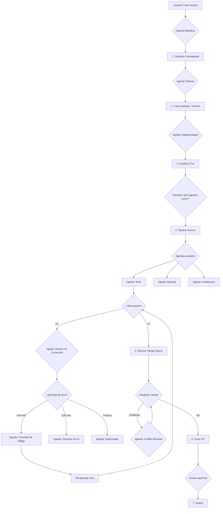

# Plan: Pipeline Inteligente End-to-End con Hatchet

## Resumen Ejecutivo

Este plan documenta cómo funcionaría un pipeline completo desde "crear feature" hasta "deploy", combinando:

1. **Pasos determinísticos** — Orquestados por Hatchet (clasificación de tier, git operations, CI/CD)
2. **Decisiones de agentes LLM** — Cualquier LLM (Claude, GPT-4, local models) evalúa y decide (qué tests correr, cómo corregir errores, resolver conflictos)

**Arquitectura actual descubierta**: Ya existe un sistema robusto en `packages/agent/` con:
- `PipelineRunner` — Orquesta agentes de calidad en paralelo
- `Director` — Gestiona cola de merge basado en dependencias y prioridad
- `Integrator` — Maneja merge conflicts vía agente LLM
- `TierClassifier` — Clasifica complejidad (small/medium/large)
- `Saga` — Compensating transactions para rollbacks

**Arquitectura agnóstica**: El sistema NO está atado a Claude Code ni a ningún LLM. Cada agente puede usar un proveedor/modelo DIFERENTE:
- **Claude API** (Anthropic) — Sonnet, Opus, Haiku
- **OpenAI API** — GPT-4, GPT-4-turbo, o1
- **Local models** — Ollama, LM Studio, vLLM
- **Otros providers** — Google Gemini, Mistral, Cohere

**Decisiones clave**:
- ❌ **NO usar CrewAI/AGNO** — Son Python, nuestro stack es TypeScript
- ❌ **NO depender de Task tool de Claude Code** — Es exclusiva de Claude Code CLI
- ✅ **Construir AgentExecutor propio** (~200 líneas TypeScript) — Agentic loop genérico con tool calling
- ✅ **Hatchet** orquesta workflows y pasa contexto entre agentes (no el LLM)
- ✅ **agent-browser** para E2E testing (CLI via Bash, agnóstico al LLM)

**Propuesta**: Extender esta arquitectura con:
1. **AgentExecutor** — Agentic loop propio en TypeScript que funciona con cualquier LLM
2. **LLMProviderFactory** — Abstracción multi-provider con fallback
3. **AgentContext** — Contexto acumulativo que Hatchet pasa entre agentes (no el LLM)
4. **Hatchet** — Workflows durables de larga duración

---

## Arquitectura: Comunicación entre Agentes

### El problema resuelto

La comunicación entre agentes NO pasa por el context window de un LLM orquestador.
En su lugar, **Hatchet pasa el contexto** entre steps como datos estructurados:

```
ANTES (atado a Claude Code):
  Claude Code CLI → Task tool → Sub-agente (otro Claude Code)
  ↑ TODO vive dentro del context window de UN solo LLM

AHORA (agnóstico):
  Hatchet Step 1 → AgentExecutor(LLM-A) → AgentResult JSON
                                                ↓
  Hatchet Step 2 → AgentExecutor(LLM-B) → AgentResult JSON  ← recibe resultado anterior
                                                ↓
  Hatchet Step 3 → AgentExecutor(LLM-C) → AgentResult JSON  ← recibe TODOS los anteriores
  ↑ Hatchet pasa el contexto, NO el LLM
  ↑ Cada agente puede ser un modelo/provider DIFERENTE
```

### AgentExecutor: Agentic Loop Genérico

```typescript
// packages/core/src/agents/agent-executor.ts

export class AgentExecutor {
  constructor(
    private llmFactory: LLMProviderFactory,
    private toolRunner: ToolRunner
  ) {}

  /**
   * Ejecuta un agente como un agentic loop:
   * 1. Envía prompt + contexto al LLM
   * 2. LLM responde con texto o tool_calls
   * 3. Si hay tool_calls → ejecutar tools → enviar resultados al LLM
   * 4. Repetir hasta que LLM dé resultado final
   * 5. Parsear resultado como JSON estructurado
   */
  async execute(role: AgentRole, context: AgentContext): Promise<AgentResult> {
    const provider = this.llmFactory.getProvider(role.provider)

    const messages: LLMMessage[] = [
      { role: 'system', content: role.systemPrompt },
      { role: 'user', content: this.buildContextPrompt(context) }
    ]

    for (let turn = 0; turn < role.maxTurns; turn++) {
      const response = await provider.complete({
        messages,
        model: role.model,
        tools: this.getToolDefinitions(role.tools)
      })

      // Si hay tool calls → ejecutar y continuar loop
      if (response.tool_calls?.length) {
        messages.push({
          role: 'assistant',
          content: response.content,
          tool_calls: response.tool_calls
        })

        for (const tc of response.tool_calls) {
          const result = await this.toolRunner.execute(
            tc.name,
            tc.arguments,
            context.worktreePath
          )
          messages.push({
            role: 'tool',
            tool_call_id: tc.id,
            content: result
          })
        }
        continue
      }

      // Sin tool calls → resultado final
      return this.parseResult(role, response.content)
    }

    throw new Error(`Agent ${role.name} exceeded max turns`)
  }

  private buildContextPrompt(context: AgentContext): string {
    let prompt = `## Context
- Branch: ${context.branch}
- Working directory: ${context.worktreePath}
- Tier: ${context.tier}
- Files changed: ${context.diffStats.filesChanged}
- Lines changed: ${context.diffStats.totalLines}
`
    // Inyectar resultados de agentes anteriores
    if (context.previousResults.size > 0) {
      prompt += `\n## Previous Agent Results\n`
      for (const [name, result] of context.previousResults) {
        prompt += `\n### ${name}: ${result.status}\n`
        prompt += result.findings
          .map(f => `- [${f.severity}] ${f.description}`)
          .join('\n')
      }
    }

    return prompt
  }
}
```

### AgentRole: Cada agente con SU modelo

```typescript
// packages/agent/src/config/agent-roles.ts

export const AGENT_ROLES: Record<AgentName, AgentRole> = {
  tests: {
    name: 'tests',
    systemPrompt: 'You are a test engineer. Run tests, analyze failures, fix code.',
    model: 'claude-3-5-haiku-20241022',  // Rápido y barato
    provider: 'claude',
    tools: ['bash', 'read', 'edit'],
    maxTurns: 30,
    outputSchema: AgentResultSchema
  },
  security: {
    name: 'security',
    systemPrompt: 'You are a security auditor. Check for OWASP Top 10.',
    model: 'gpt-4-turbo-preview',        // Puede ser otro provider!
    provider: 'openai',
    tools: ['bash', 'read'],
    maxTurns: 20,
    outputSchema: AgentResultSchema
  },
  architecture: {
    name: 'architecture',
    systemPrompt: 'Review SOLID, coupling, cohesion.',
    model: 'llama3:70b',                 // Modelo local para privacidad!
    provider: 'ollama',
    tools: ['read'],
    maxTurns: 15,
    outputSchema: AgentResultSchema
  },
  e2e: {
    name: 'e2e',
    systemPrompt: 'Use agent-browser CLI to validate UI.',
    model: 'claude-3-5-sonnet-20241022',
    provider: 'claude',
    tools: ['bash', 'agent-browser'],    // agent-browser via Bash!
    maxTurns: 40,
    outputSchema: AgentResultSchema
  },
  // ... más agentes
}
```

### AgentContext: Contexto acumulativo

```typescript
// packages/core/src/agents/types.ts

export interface AgentContext {
  // Contexto del pipeline
  branch: string
  worktreePath: string
  tier: Tier
  diffStats: DiffStats

  // Resultados acumulados de agentes anteriores
  previousResults: Map<AgentName, AgentResult>
}

export interface AgentResult {
  agent: AgentName
  status: 'passed' | 'failed' | 'warning'
  findings: Finding[]
  fixes_applied: string[]
  metadata: Record<string, unknown>
}

export interface Finding {
  severity: 'critical' | 'high' | 'medium' | 'low' | 'info'
  description: string
  file?: string
  line?: number
  fix_applied?: boolean
}
```

### Hatchet Workflow: Orquesta agentes con contexto compartido

```typescript
// packages/agent/src/hatchet/workflows/quality-pipeline.ts

const qualityPipeline = workflow('quality-pipeline', async (ctx) => {
  const { branch, worktreePath, tier } = ctx.workflowInput()
  const executor = new AgentExecutor(llmFactory, toolRunner)

  const context: AgentContext = {
    branch,
    worktreePath,
    tier,
    diffStats: await classifyTier(worktreePath, 'main', thresholds),
    previousResults: new Map()
  }

  const agents = tierAgents[tier]

  // === PARALELO: Agentes independientes ===
  const independentAgents = agents.filter(a => !DEPENDS_ON[a]?.length)

  const parallelResults = await Promise.all(
    independentAgents.map(agentName =>
      ctx.step(`agent-${agentName}`, async () => {
        return await executor.execute(AGENT_ROLES[agentName], context)
      })
    )
  )

  // Acumular resultados
  for (const result of parallelResults) {
    context.previousResults.set(result.agent, result)
  }

  // === SECUENCIAL: Agentes que dependen de resultados anteriores ===
  const dependentAgents = agents.filter(a => DEPENDS_ON[a]?.length)

  for (const agentName of dependentAgents) {
    const result = await ctx.step(`agent-${agentName}`, async () => {
      return await executor.execute(AGENT_ROLES[agentName], context)
      // ↑ Este agente VE los resultados de los anteriores en context
    })
    context.previousResults.set(result.agent, result)
  }

  // === DECISIÓN: ¿Necesita corrección? ===
  const failedAgents = [...context.previousResults.values()]
    .filter(r => r.status === 'failed')

  if (failedAgents.length > 0 && ctx.workflowInput().correctionAttempt < maxCorrections) {
    // Corregir y re-ejecutar agentes fallidos
    const correctionResult = await ctx.step('correct', async () => {
      return await executor.execute(AGENT_ROLES.corrector, {
        ...context,
        failedAgents
      })
    })

    // Re-run solo los que fallaron
    for (const failed of failedAgents) {
      await ctx.step(`retry-${failed.agent}`, async () => {
        return await executor.execute(AGENT_ROLES[failed.agent], context)
      })
    }
  }

  return Object.fromEntries(context.previousResults)
})
```

---

## Arquitectura: Abstracción de LLM Provider

Para no depender de un proveedor específico, usamos una **abstracción de LLM** similar a LangChain pero más simple:

### Interface de Provider

```typescript
// packages/core/src/agents/llm-provider.ts
export interface LLMMessage {
  role: 'system' | 'user' | 'assistant'
  content: string
}

export interface LLMCompletionRequest {
  messages: LLMMessage[]
  model: string
  temperature?: number
  max_tokens?: number
  tools?: ToolDefinition[]
  response_format?: { type: 'json_object' | 'text' }
}

export interface LLMCompletionResponse {
  content: string
  usage: {
    prompt_tokens: number
    completion_tokens: number
    total_tokens: number
  }
  tool_calls?: ToolCall[]
}

export interface ILLMProvider {
  complete(request: LLMCompletionRequest): Promise<LLMCompletionResponse>
  stream(request: LLMCompletionRequest): AsyncIterator<string>
  name: string
}
```

### Implementaciones concretas

```typescript
// packages/core/src/agents/providers/claude.ts
export class ClaudeProvider implements ILLMProvider {
  name = 'claude'

  async complete(req: LLMCompletionRequest): Promise<LLMCompletionResponse> {
    const response = await fetch('https://api.anthropic.com/v1/messages', {
      method: 'POST',
      headers: {
        'x-api-key': process.env.ANTHROPIC_API_KEY,
        'anthropic-version': '2023-06-01',
        'content-type': 'application/json'
      },
      body: JSON.stringify({
        model: req.model, // 'claude-3-5-sonnet-20241022'
        messages: req.messages,
        max_tokens: req.max_tokens ?? 4096,
        temperature: req.temperature ?? 1.0
      })
    })
    // ... mapear respuesta
  }
}

// packages/core/src/agents/providers/openai.ts
export class OpenAIProvider implements ILLMProvider {
  name = 'openai'

  async complete(req: LLMCompletionRequest): Promise<LLMCompletionResponse> {
    const response = await fetch('https://api.openai.com/v1/chat/completions', {
      method: 'POST',
      headers: {
        'Authorization': `Bearer ${process.env.OPENAI_API_KEY}`,
        'content-type': 'application/json'
      },
      body: JSON.stringify({
        model: req.model, // 'gpt-4-turbo-preview'
        messages: req.messages,
        max_tokens: req.max_tokens,
        temperature: req.temperature,
        response_format: req.response_format
      })
    })
    // ... mapear respuesta
  }
}

// packages/core/src/agents/providers/ollama.ts
export class OllamaProvider implements ILLMProvider {
  name = 'ollama'

  async complete(req: LLMCompletionRequest): Promise<LLMCompletionResponse> {
    const response = await fetch('http://localhost:11434/api/chat', {
      method: 'POST',
      body: JSON.stringify({
        model: req.model, // 'llama3:70b'
        messages: req.messages,
        options: {
          temperature: req.temperature,
          num_predict: req.max_tokens
        }
      })
    })
    // ... mapear respuesta
  }
}
```

### Factory pattern

```typescript
// packages/core/src/agents/llm-factory.ts
export class LLMProviderFactory {
  private providers = new Map<string, ILLMProvider>()

  constructor() {
    this.providers.set('claude', new ClaudeProvider())
    this.providers.set('openai', new OpenAIProvider())
    this.providers.set('ollama', new OllamaProvider())
  }

  getProvider(name: string): ILLMProvider {
    const provider = this.providers.get(name)
    if (!provider) {
      throw new Error(`Unknown LLM provider: ${name}`)
    }
    return provider
  }
}
```

### Configuración

```typescript
// packages/agent/config/llm.ts
export interface LLMConfig {
  default_provider: 'claude' | 'openai' | 'ollama'
  models: {
    planner: string      // Para análisis de complejidad
    implementer: string  // Para implementar código
    reviewer: string     // Para tests, security, etc.
    conflict: string     // Para resolver merge conflicts (modelo más capaz)
  }
}

// Ejemplo: Todo Claude
const claudeConfig: LLMConfig = {
  default_provider: 'claude',
  models: {
    planner: 'claude-3-5-sonnet-20241022',
    implementer: 'claude-3-5-sonnet-20241022',
    reviewer: 'claude-3-5-haiku-20241022',
    conflict: 'claude-opus-4-20250514'
  }
}

// Ejemplo: Mix Claude + OpenAI
const mixedConfig: LLMConfig = {
  default_provider: 'openai',
  models: {
    planner: 'gpt-4-turbo-preview',
    implementer: 'gpt-4-turbo-preview',
    reviewer: 'gpt-4-turbo-preview',
    conflict: 'claude-opus-4-20250514' // Usar Claude Opus para conflictos complejos
  }
}

// Ejemplo: Todo local con Ollama
const localConfig: LLMConfig = {
  default_provider: 'ollama',
  models: {
    planner: 'llama3:70b',
    implementer: 'llama3:70b',
    reviewer: 'llama3:70b',
    conflict: 'llama3:70b'
  }
}
```

---

## Flujo End-to-End: "Implementar nuevo feature"

### Entrada del usuario

```
Usuario: "Implementa autenticación con OAuth2"
```

### Pipeline completo



---

## Detalle Paso por Paso

### **Paso 1: Clasificar Complejidad del Feature** 🤖

**Tipo**: Decisión de Agente LLM

**Input**: Descripción del usuario ("Implementa autenticación con OAuth2")

**Proceso**:
```typescript
// Hatchet workflow - AGNÓSTICO AL LLM
const classifyComplexity = workflow('classify-feature', async (ctx) => {
  // Agente analiza la solicitud usando el provider configurado
  const analysis = await ctx.step('analyze-request', async () => {
    return await llmProvider.complete({
      messages: [{
        role: 'user',
        content: `Analiza esta solicitud y determina:

1. Complejidad estimada (small/medium/large)
2. Archivos que probablemente se modificarán
3. Tipos de tests necesarios (unit, integration, e2e)
4. Riesgos de seguridad potenciales

Solicitud: "${ctx.workflowInput().userPrompt}"

Responde en JSON:
{
  "complexity": "small|medium|large",
  "estimated_files": number,
  "estimated_lines": number,
  "test_types": ["unit", "integration", "e2e"],
  "security_risks": ["xss", "injection", ...],
  "recommended_agents": ["tests", "security", ...]
}`
      }],
      model: config.models.planner, // Configurable: 'gpt-4', 'claude-sonnet', 'llama3-70b', etc.
      temperature: 0.3,
      response_format: { type: 'json_object' }
    })
  })

  // Guardar decisión para pasos posteriores
  ctx.workflowInput().complexity_analysis = JSON.parse(analysis.content)

  return analysis
})
```

**Output**:
```json
{
  "complexity": "medium",
  "estimated_files": 8,
  "estimated_lines": 450,
  "test_types": ["unit", "integration", "e2e"],
  "security_risks": ["token_storage", "csrf", "session_hijacking"],
  "recommended_agents": ["tests", "security", "architecture", "docs"]
}
```

**Decisión tomada**: Qué agentes se necesitarán más adelante.

---

### **Paso 2: Crear worktree + branch** ✅

**Tipo**: Determinístico (Hatchet + git)

**Proceso**:
```typescript
const setupBranch = workflow('setup-branch', async (ctx) => {
  const analysis = ctx.workflowInput().complexity_analysis

  await ctx.step('create-worktree', async () => {
    // Git operations determinísticas
    await execute('git', ['worktree', 'add', ...])
    await execute('git', ['checkout', '-b', 'feature/oauth2'])
  })
})
```

---

### **Paso 3: Implementar Feature** 🤖

**Tipo**: Agente LLM (modelo seleccionado según complejidad)

**Proceso**:
```typescript
const implementFeature = workflow('implement', async (ctx) => {
  const { complexity_analysis, userPrompt } = ctx.workflowInput()

  // Seleccionar modelo según complejidad (configurable)
  const model = complexity_analysis.complexity === 'large'
    ? config.models.implementer_large  // e.g., 'claude-opus', 'gpt-4-turbo', 'llama3:70b'
    : config.models.implementer        // e.g., 'claude-sonnet', 'gpt-4', 'llama3:8b'

  const implementation = await ctx.step('implement-code', async () => {
    // Usar AgentOrchestrator que es agnóstico al LLM
    return await agentOrchestrator.startAgent({
      threadId: nanoid(),
      prompt: buildImplementationPrompt(userPrompt, complexity_analysis),
      cwd: worktreePath,
      model,
      provider: config.default_provider, // 'claude' | 'openai' | 'ollama'
      permissionMode: 'autoEdit',
      maxTurns: 200
    })
  })

  // Esperar a que el agente termine
  await ctx.step('wait-for-completion', async () => {
    return await waitForCompletion(implementation.threadId)
  })
})
```

---

### **Paso 4: Clasificar Tier (Post-Implementación)** ✅

**Tipo**: Determinístico (basado en git diff stats)

**Proceso**:
```typescript
// Ya existe en tier-classifier.ts
const { tier, stats } = await classifyTier(
  worktreePath,
  'main',
  {
    small: { max_files: 3, max_lines: 50 },
    medium: { max_files: 10, max_lines: 300 }
  }
)

// Resultado:
// tier = 'medium' (porque fueron 8 archivos, 450 líneas)
// stats = { filesChanged: 8, insertions: 380, deletions: 70 }
```

---

### **Paso 5: Pipeline de Calidad con Decisiones Inteligentes** 🤖 + ✅

**Tipo**: Híbrido (orquestación determinística + agentes inteligentes)

#### 5.1. Determinar qué agentes ejecutar ✅

```typescript
// Usa el análisis del Paso 1 + tier del Paso 4
const tierAgents = {
  small: ['tests', 'style'],
  medium: ['tests', 'security', 'architecture', 'style', 'types'],
  large: ['tests', 'security', 'architecture', 'performance', 'style', 'types', 'docs', 'integration']
}

// Combinar con recomendaciones del agente analizador
const finalAgents = [
  ...tierAgents[tier],
  ...complexity_analysis.recommended_agents
].filter(unique)

// Para nuestro caso: ['tests', 'security', 'architecture', 'style', 'types', 'docs']
```

#### 5.2. Ejecutar agentes en paralelo 🤖

```typescript
// Ya existe en pipeline-runner.ts
const pipelinePrompt = buildPipelinePrompt(
  request,
  tier, // 'medium'
  tierAgents,
  maxCorrections: 2,
  pipelinePrefix: 'pipeline/'
)

// El agente orquestador corre agentes en paralelo usando Task tool
await orchestrator.startAgent({
  threadId: requestId,
  prompt: pipelinePrompt,
  model: 'sonnet'
})

// Prompt generado (excerpt):
`
Launch the following quality agents **in parallel** using the Task tool:

- **tests**: Run the test suite. If tests fail, fix the code and re-run until they pass.
- **security**: Audit for OWASP Top 10 (OAuth2 → check token storage, CSRF, session hijacking)
- **architecture**: Review coupling, SOLID principles
...
`
```

#### 5.3. Agente "Tests" con decisiones inteligentes 🤖

**Escenario 1: Tests pasan** ✅
```
Agente Tests:
1. Ejecuta: `bun test`
2. Resultado: ✅ 45/45 tests passed
3. Reporta: "All tests passing"
```

**Escenario 2: Tests fallan — Agente decide qué hacer** 🤖

```typescript
// Dentro del agente "Tests"
const testResult = await bash('bun test')

if (testResult.exitCode !== 0) {
  // Agente ANALIZA el error (no es determinístico)
  const errorAnalysis = `
  Error log:
  ${testResult.stderr}

  ❌ FAIL src/auth/oauth.test.ts
    × should redirect to OAuth provider
      Expected: "https://provider.com/oauth"
      Received: "http://provider.com/oauth"  // HTTP vs HTTPS!

  Decisión del agente:
  1. El problema es un protocolo incorrecto en la URL
  2. Archivo afectado: src/auth/oauth-config.ts
  3. Fix: Cambiar baseUrl de http:// a https://
  `

  // Agente EJECUTA el fix
  await edit('src/auth/oauth-config.ts', {
    old: 'baseUrl: "http://provider.com"',
    new: 'baseUrl: "https://provider.com"'
  })

  // RE-EJECUTA tests
  const retestResult = await bash('bun test')

  if (retestResult.exitCode !== 0) {
    // SEGUNDA CORRECCIÓN (si es necesario)
    // ...
  }
}
```

**Escenario 3: E2E testing con agent-browser** 🤖

```bash
# Agente usa agent-browser para E2E testing (funciona con CUALQUIER LLM via Bash)

# 1. Iniciar app del worktree
cd /worktree/feature-oauth2 && bun run start &

# 2. Abrir browser con session aislada
agent-browser --session pipeline-abc123 open http://localhost:3000

# 3. Snapshot token-eficiente para entender la UI
agent-browser --session pipeline-abc123 snapshot -i
# Output: @e1 [button] "Login" | @e2 [input] "Email" | @e3 [link] "Sign up" ...

# 4. Navegar al flujo OAuth
agent-browser --session pipeline-abc123 click @e1
agent-browser --session pipeline-abc123 wait --url "**/oauth/callback"
agent-browser --session pipeline-abc123 screenshot /tmp/oauth-redirect.png

# 5. Verificar errores en console del browser
agent-browser --session pipeline-abc123 errors
# Output: Uncaught TypeError: Cannot read property 'access_token' of undefined
#         at OAuthCallback.tsx:45

# 6. Agente ANALIZA el error y decide el fix
# → Detecta: null-check faltante en OAuthCallback.tsx:45
# → Aplica fix y re-valida:

agent-browser --session pipeline-abc123 reload
agent-browser --session pipeline-abc123 click @e1
agent-browser --session pipeline-abc123 errors
# Output: (empty) ✅

# 7. Capturar video como evidencia
agent-browser --session pipeline-abc123 record start
# ... re-run todo el flujo ...
agent-browser --session pipeline-abc123 record stop evidence.webm

# 8. Cleanup
agent-browser --session pipeline-abc123 close
```

**Ventajas de agent-browser sobre `bun test:e2e`:**
- ✅ El agente VE la UI real, no solo salida de terminal
- ✅ Puede interactuar con elementos dinámicos (@refs)
- ✅ Browser console logs accesibles directamente
- ✅ Screenshots y video como evidencia
- ✅ Session aislada por worktree = sin interferencia
- ✅ Funciona con CUALQUIER LLM (Claude, GPT-4, Ollama) via Bash

#### 5.4. Agente "Security" con decisiones contextuales 🤖

```typescript
// Agente security NO corre un scanner automático genérico
// En lugar de eso, ANALIZA el código específico del feature

const securityAnalysis = `
Audité los cambios en OAuth2. Hallazgos:

🔴 CRÍTICO:
- Token almacenado en localStorage (vulnerable a XSS)
  Archivo: src/auth/token-storage.ts:12
  Recomendación: Usar httpOnly cookies

🟡 MEDIO:
- No hay CSRF protection en el callback endpoint
  Archivo: src/api/oauth/callback.ts:8
  Recomendación: Validar state parameter

✅ OK:
- HTTPS enforced
- Token expiration implementado correctamente
`

// Agente DECIDE si bloquear o solo advertir
if (criticalIssues.length > 0) {
  // Agente IMPLEMENTA el fix
  await edit('src/auth/token-storage.ts', ...)

  // RE-EJECUTA security check
}
```

---

### **Paso 6: Corrección Automática (Pipeline Event Mapper)** 🤖

**Tipo**: Decisión de Agente (detectada por pattern matching)

**Proceso**:
```typescript
// event-mapper.ts ya detecta ciclos de corrección
const CORRECTION_PATTERNS = [
  /correction\s+cycle/i,
  /re-?runn?ing\s+(the\s+)?failing/i,
  /applying\s+(the\s+)?fix/i,
]

// Cuando el agente orquestador dice:
assistant: "Los tests fallaron. Aplicando corrección y re-ejecutando..."

// EventMapper detecta:
if (isCorrectingText(fullText)) {
  this.correctionCount++ // = 1
  emit('pipeline.correcting', { correction_number: 1 })
}

// Límite de correcciones (determinístico):
if (this.correctionCount >= maxCorrections) { // 2
  emit('pipeline.failed', {
    error: 'Max corrections reached',
    corrections_count: 2
  })
}
```

---

### **Paso 7: Director — Merge Queue** ✅

**Tipo**: Determinístico (basado en dependencias y prioridad)

**Proceso**:
```typescript
// director.ts ya implementa esto
const manifest = await manifestManager.read()

// Manifest example:
{
  ready: [
    {
      branch: 'feature/oauth2',
      priority: 5,
      depends_on: [], // Sin dependencias
      pipeline_result: {
        tests: { status: 'passed' },
        security: { status: 'passed' },
        architecture: { status: 'passed' }
      }
    },
    {
      branch: 'feature/user-profile',
      priority: 10,
      depends_on: ['feature/oauth2'], // Depende de OAuth2
    }
  ]
}

// Director procesa en orden de prioridad:
const eligible = manifest.ready
  .filter(entry => entry.depends_on.every(dep => mergedBranches.has(dep)))
  .sort((a, b) => a.priority - b.priority)

// feature/oauth2 es elegible (priority=5, sin dependencias bloqueadas)
// feature/user-profile NO es elegible (depende de oauth2 que aún no se mergea)
```

---

### **Paso 8: Integrator — Merge con Resolución de Conflictos** 🤖

**Tipo**: Híbrido (merge determinístico + agente para conflictos)

#### 8.1. Merge sin conflictos ✅

```typescript
// integrator.ts — Saga pattern
await saga.addStep({
  name: 'merge_pipeline',
  action: async () => {
    const result = await execute('git', ['merge', '--no-ff', 'pipeline/feature/oauth2'])

    if (result.exitCode === 0) {
      // ✅ Merge limpio
      return
    }

    // Detectar conflictos...
  }
})
```

#### 8.2. Merge con conflictos — Agente LLM de Alta Capacidad 🤖

```typescript
// Conflictos detectados
const conflictedFiles = ['src/auth/index.ts', 'package.json']

// Usar el modelo más capaz para resolución de conflictos
const conflictPrompt = `
You are resolving merge conflicts in a git repository.

## Conflicted files
- src/auth/index.ts
- package.json

## Instructions
1. Read each conflicted file
2. Resolve markers (<<<<<<, ======, >>>>>>) semantically
3. Prefer pipeline branch changes (they are reviewed)
4. Stage resolved files
5. Commit with: "fix(integration): resolve merge conflicts"
`

const resolved = await orchestrator.startAgent({
  threadId: `conflict-${nanoid()}`,
  prompt: conflictPrompt,
  model: config.models.conflict, // 'claude-opus', 'gpt-4-turbo', 'llama3:70b'
  provider: config.default_provider,
  maxTurns: 50
})

// Agente DECIDE cómo resolver cada conflicto contextualmente
// (funciona igual independientemente del LLM usado)
```

**Ejemplo de decisión del agente**:
```typescript
// src/auth/index.ts — Conflicto:
<<<<<<< HEAD (main)
export { login, logout } from './basic-auth'
=======
export { login, logout, oauthLogin } from './oauth'
>>>>>>> pipeline/feature/oauth2

// Agente ANALIZA:
`
Main branch: exporta funciones de basic-auth
Pipeline: exporta funciones de oauth (incluye nueva función oauthLogin)

Decisión: Ambos son necesarios. Combinar:
- Mantener basic-auth para compatibilidad
- Añadir oauth para nuevo feature
`

// Agente IMPLEMENTA:
export { login as basicLogin, logout as basicLogout } from './basic-auth'
export { login as oauthLogin, logout as oauthLogout, oauthLogin } from './oauth'
```

---

### **Paso 9: Crear PR** ✅

**Tipo**: Determinístico (con datos de agentes)

```typescript
// integrator.ts
const prBody = buildPRBody(entry, conflictsResolved)

const prResult = await createPR(cwd,
  'Integrate: feature/oauth2',
  `
## Pipeline Results (Tier: medium)

| Agent | Status | Details |
|-------|--------|---------|
| tests | ✅ passed | 48/48 tests passing |
| security | ✅ passed | No critical issues, 1 warning addressed |
| architecture | ✅ passed | SOLID principles followed |
| style | ✅ passed | Linting passed |
| types | ✅ passed | No type errors |
| docs | ✅ passed | API docs updated |

### Corrections Applied
- Fixed HTTPS protocol in OAuth config (correction 1)
- Added null-check in OAuthCallback (correction 1)
- Moved token storage to httpOnly cookies (security fix)

### Conflict Resolution
Merge conflicts were automatically resolved by Claude (Opus).

---
*Automated by funny Pipeline Service*
  `,
  'main'
)
```

---

### **Paso 10: Human Approval + Deploy** ✅

**Tipo**: Human-in-the-loop (vía Hatchet events)

```typescript
const deployWorkflow = workflow('deploy-after-approval', async (ctx) => {
  const { pr_number, pr_url } = ctx.workflowInput()

  // Esperar aprobación humana (Hatchet event)
  const approved = await ctx.waitForEvent('pr.approved', {
    timeout: '24h' // Esperar hasta 24 horas
  })

  if (!approved) {
    throw new Error('PR approval timeout')
  }

  // Merge PR
  await ctx.step('merge-pr', async () => {
    await execute('gh', ['pr', 'merge', pr_number, '--squash'])
  })

  // Deploy
  await ctx.step('deploy', async () => {
    await execute('vercel', ['deploy', '--prod'])
  })
})

// Usuario aprueba desde UI de Hatchet o webhook:
// POST /workflows/{workflowId}/events/pr.approved
```

---

## Resumen: Determinístico vs Agente

| Paso | Tipo | Responsable | Decisión |
|------|------|-------------|----------|
| 1. Clasificar feature | 🤖 Agente | LLM (planner) | ¿Qué complejidad? ¿Qué agentes necesarios? |
| 2. Crear worktree | ✅ Determinístico | Hatchet + git | - |
| 3. Implementar código | 🤖 Agente | LLM (implementer) | ¿Cómo implementar el feature? |
| 4. Clasificar tier | ✅ Determinístico | TierClassifier | Basado en git diff stats |
| 5a. Seleccionar agentes | ✅ Determinístico | Config + Paso 1 | Tier config + análisis inicial |
| 5b. Ejecutar tests | 🤖 Agente | LLM (reviewer) | ¿Qué tipo de error? ¿Cómo corregir? |
| 5e. E2E tests | 🤖 Agente | LLM + agent-browser (Bash) | UI funciona? Console errors? Visual correcta? |
| 5c. Security audit | 🤖 Agente | LLM (reviewer) | ¿Crítico o warning? ¿Cómo mitigar? |
| 5d. Architecture review | 🤖 Agente | LLM (reviewer) | ¿Viola principios? ¿Cómo refactorizar? |
| 6. Ciclo de corrección | 🤖 Agente | EventMapper + LLM | ¿Necesita corrección? ¿Cuántas veces? |
| 7. Merge queue | ✅ Determinístico | Director | Basado en depends_on + priority |
| 8a. Merge limpio | ✅ Determinístico | Integrator | - |
| 8b. Resolver conflictos | 🤖 Agente | LLM (conflict) | ¿Cómo resolver semánticamente? |
| 9. Crear PR | ✅ Determinístico | Integrator | Usa datos de agentes |
| 10. Human approval | ⏸️ Humano | User (via Hatchet) | ¿Aprobar o rechazar? |
| 11. Deploy | ✅ Determinístico | Hatchet workflow | - |

**Nota**: Los modelos específicos (planner, implementer, reviewer, conflict) son configurables y pueden ser de cualquier provider (Claude, OpenAI, Ollama, etc.).

---

## Integración con Hatchet

### Workflow principal

```typescript
// packages/agent/src/hatchet/workflows/feature-to-deploy.ts
import Hatchet, { workflow } from '@hatchet-dev/typescript-sdk'

const featureToDeployWorkflow = workflow('feature-to-deploy', async (ctx) => {
  const { userPrompt, projectId } = ctx.workflowInput()

  // Paso 1: Clasificar complejidad (agente)
  const analysis = await ctx.step('classify-complexity', async () => {
    const thread = await createFunnyThread({
      projectId,
      prompt: buildAnalysisPrompt(userPrompt),
      model: 'sonnet'
    })
    return await waitForCompletion(thread.id)
  })

  // Paso 2: Crear worktree (determinístico)
  await ctx.step('create-worktree', async () => {
    return await fetch('/api/worktrees', {
      method: 'POST',
      body: JSON.stringify({ projectId, branch: 'feature/oauth2' })
    })
  })

  // Paso 3: Implementar (agente)
  const implementation = await ctx.step('implement-feature', async () => {
    const model = analysis.complexity === 'large' ? 'opus' : 'sonnet'
    const thread = await createFunnyThread({
      projectId,
      prompt: userPrompt,
      model,
      mode: 'worktree'
    })
    return await waitForCompletion(thread.id)
  })

  // Paso 4: Pipeline de calidad (agentes en paralelo vía PipelineRunner)
  const pipelineResult = await ctx.step('quality-pipeline', async () => {
    return await fetch('/api/pipeline/run', {
      method: 'POST',
      body: JSON.stringify({
        request_id: nanoid(),
        branch: 'feature/oauth2',
        worktree_path: implementation.worktreePath,
        config: {
          agents: analysis.recommended_agents
        }
      })
    })
  })

  // Esperar a que pipeline complete
  await ctx.step('wait-for-pipeline', async () => {
    // Polling del status
    while (true) {
      const status = await fetch(`/api/pipeline/status/${pipelineResult.request_id}`)
      if (status.status === 'approved') return status
      if (status.status === 'failed') throw new Error('Pipeline failed')
      await new Promise(r => setTimeout(r, 5000))
    }
  })

  // Paso 7-8: Director + Integrator (ya automático vía eventos)
  // Director escucha 'pipeline.completed' y dispara integration

  // Paso 10: Esperar aprobación humana
  const approved = await ctx.waitForEvent('pr.approved', {
    timeout: '24h'
  })

  if (!approved) {
    throw new Error('PR not approved within 24h')
  }

  // Paso 11: Deploy
  await ctx.step('deploy', async () => {
    return await fetch('/api/deploy', {
      method: 'POST',
      body: JSON.stringify({ branch: 'feature/oauth2' })
    })
  })

  return { success: true, deployed_at: new Date().toISOString() }
}, {
  // Rate limiting: máximo 3 features simultáneos
  rateLimits: {
    maxRuns: 3,
    window: '1h'
  }
})

export { featureToDeployWorkflow }
```

---

## Ventajas de esta Arquitectura

### 1. **No es totalmente determinístico** (esto es bueno)
- Los agentes DECIDEN basados en contexto real
- Ejemplo: "tests fallan" → agente analiza el error específico y decide la corrección
- No es un simple `if exitCode !== 0 then retry`

### 2. **Puntos de decisión claros**
- Clasificación de complejidad → agente decide tier + agentes necesarios
- Corrección de tests → agente decide QUÉ falló y CÓMO arreglarlo
- Resolución de conflictos → agente decide semánticamente (no git merge strategies automáticas)
- Security audit → agente decide CRITICIDAD y si bloquear o advertir

### 3. **Orquestación robusta**
- Hatchet maneja workflows de larga duración (días si es necesario)
- Sagas permiten rollback automático si algo falla
- Circuit breakers protegen APIs LLM (Claude, OpenAI, Ollama) y GitHub
- DLQ (Dead Letter Queue) para reintentos

### 4. **Observabilidad completa**
- Cada decisión de agente queda registrada en eventos
- Hatchet UI muestra estado en tiempo real
- Request Logger guarda todo para auditoría

### 5. **Agnóstico al LLM Provider** ✨

**Ventajas principales**:
- **Flexibilidad**: Cambiar de Claude a GPT-4 es solo actualizar la config
- **Costos**: Usar modelos más baratos para tareas simples (Haiku, gpt-3.5-turbo)
- **Privacidad**: Opción de usar modelos locales (Ollama) para datos sensibles
- **Resiliencia**: Fallback automático si un provider falla
- **Testing**: Usar modelos más rápidos/baratos en desarrollo

**Ejemplos de configuración**:

```typescript
// Producción: Claude para calidad máxima
const prodConfig = {
  default_provider: 'claude',
  models: {
    planner: 'claude-3-5-sonnet-20241022',
    implementer: 'claude-3-5-sonnet-20241022',
    reviewer: 'claude-3-5-haiku-20241022',  // Más barato para reviews
    conflict: 'claude-opus-4-20250514'      // Mejor para conflictos
  }
}

// Desarrollo: Mix para optimizar costo
const devConfig = {
  default_provider: 'openai',
  models: {
    planner: 'gpt-4-turbo-preview',
    implementer: 'gpt-4-turbo-preview',
    reviewer: 'gpt-3.5-turbo',             // Más barato
    conflict: 'claude-opus-4-20250514'     // Claude es mejor para conflictos
  }
}

// Local: Todo privado
const localConfig = {
  default_provider: 'ollama',
  models: {
    planner: 'llama3:70b',
    implementer: 'codellama:34b',          // Especializado en código
    reviewer: 'llama3:8b',                 // Más rápido
    conflict: 'llama3:70b'                 // Más capaz
  }
}

// Fallback automático
const resilientConfig = {
  default_provider: 'claude',
  fallback_provider: 'openai',  // Si Claude falla, usar OpenAI
  models: {
    planner: 'claude-3-5-sonnet-20241022',
    implementer: 'claude-3-5-sonnet-20241022',
    reviewer: 'claude-3-5-haiku-20241022',
    conflict: 'claude-opus-4-20250514'
  }
}
```

**Implementación del fallback**:

```typescript
// packages/core/src/agents/llm-provider.ts
export class ResilientLLMProvider implements ILLMProvider {
  constructor(
    private primary: ILLMProvider,
    private fallback: ILLMProvider
  ) {}

  async complete(req: LLMCompletionRequest): Promise<LLMCompletionResponse> {
    try {
      return await this.primary.complete(req)
    } catch (err) {
      logger.warn(`Primary LLM failed (${this.primary.name}), falling back to ${this.fallback.name}`)
      return await this.fallback.complete(req)
    }
  }
}
```

---

## Próximos Pasos para Implementación

### Fase 0: Fundamentos agnósticos (semana 1)

1. **AgentExecutor + LLMProviderFactory** (P0, 3-4 días)
   - `packages/core/src/agents/llm-provider.ts` — Interface ILLMProvider
   - `packages/core/src/agents/providers/claude.ts` — Claude provider
   - `packages/core/src/agents/providers/openai.ts` — OpenAI provider
   - `packages/core/src/agents/providers/ollama.ts` — Ollama provider
   - `packages/core/src/agents/llm-factory.ts` — Factory + ResilientProvider (fallback)
   - `packages/core/src/agents/agent-executor.ts` — Agentic loop genérico (~150 líneas)
   - `packages/core/src/agents/tool-runner.ts` — Ejecuta bash, read, edit, agent-browser
   - `packages/core/src/agents/types.ts` — AgentRole, AgentContext, AgentResult

2. **Instalar Hatchet** (P0, 1 día)
   ```bash
   bun add @hatchet-dev/typescript-sdk
   docker run -p 8080:8080 -p 7077:7077 ghcr.io/hatchet-dev/hatchet/hatchet:latest
   ```

### Fase 1: Pipeline agnóstico (semana 2)

3. **Migrar PipelineRunner a AgentExecutor** (P0, 3-4 días)
   - Reemplazar dependencia de Claude Code CLI `Task` tool
   - Cada agente (tests, security, architecture) usa AgentExecutor
   - Hatchet orquesta paralelo/secuencial y pasa contexto
   - Cada agente puede usar un modelo/provider diferente

4. **Integrar agent-browser como tool** (P0, 2-3 días)
   - Añadir `'e2e'` a `AgentName` en `types.ts`
   - ToolRunner ejecuta `agent-browser` commands via Bash
   - Session isolation por worktree (`--session pipeline-{requestId}`)
   - Auto-start de app por worktree con puerto único

### Fase 2: Autonomía (semana 3-4)

5. **Crear Hatchet workflows** (P1, 3-4 días)
   - `feature-to-deploy.ts` — Workflow completo end-to-end
   - `continuous-architecture-eval.ts` — Workflow permanente de evaluación
   - `cleanup.ts` — Garbage collection workflows

6. **Knowledge Base + Progressive Disclosure** (P1, 2-3 días)
   - Crear estructura `docs/` (design-docs, exec-plans, product-specs)
   - Refactorizar CLAUDE.md como "map not manual" (~100 líneas)
   - Doc-gardening workflow en Hatchet

7. **Agent-to-Agent Review Loop** (P1, 4-6 días)
   - Fetch PR reviews (human + agent)
   - AgentExecutor aplica feedback y pushea
   - Loop hasta aprobación
   - Auto-merge

### Fase 3: UI + refinamiento (semana 5)

8. **UI para disparar workflows** (P2, 3-4 días)
   - Botón "Create Feature" → inicia `feature-to-deploy` workflow
   - UI muestra progreso desde Hatchet events
   - Dashboard de Quality Scores

---

## Pregunta Clave Respondida

> ¿Qué tan determinístico es el pipeline?

**Respuesta**: Es **intencionalmente NO totalmente determinístico** porque los agentes toman decisiones contextuales:

- ✅ **Determinístico**: Git operations, tier classification, merge queue ordering, deploy
- 🤖 **No determinístico (agentes)**: Análisis de errores, decisión de correcciones, resolución de conflictos, evaluación de seguridad

Esto es una **VENTAJA** porque:
- Un pipeline puramente determinístico no puede adaptarse a errores inesperados
- Los agentes aportan inteligencia donde las reglas fijas no alcanzan
- Ejemplo: Un test E2E falla por un problema de timing → un agente puede detectar "race condition" y agregar un `await`, mientras que un pipeline determinístico solo reintentaría

**El balance ideal**: Hatchet orquesta el flujo y garantías (retries, rollbacks, observabilidad), mientras los agentes LLM (independientemente del provider) aportan la inteligencia para decisiones complejas.

**Sobre no depender de ningún LLM**: El sistema usa agentes de forma completamente agnóstica:
- ✅ **NO** depende de Claude Code CLI ni de su `Task` tool
- ✅ **NO** depende de CrewAI/AGNO (Python)
- ✅ **SÍ** usa `AgentExecutor` propio en TypeScript (~200 líneas)
- ✅ **SÍ** cada agente puede usar un modelo/provider DIFERENTE
- ✅ **SÍ** la comunicación entre agentes es via `AgentContext` en Hatchet (no via context window de un LLM)
- ✅ **SÍ** soporta fallback automático entre providers
- ✅ **SÍ** usa `agent-browser` via Bash (funciona con cualquier LLM)

**Componentes nuevos a construir:**
1. `AgentExecutor` (~150 líneas) — Agentic loop genérico con tool calling
2. `LLMProviderFactory` (~100 líneas) — Multi-provider con fallback
3. `ToolRunner` (~100 líneas) — Ejecuta bash, read, edit, agent-browser
4. `AgentContext` (~50 líneas) — Contexto acumulativo entre agentes
5. Hatchet workflows — Orquestación de secuencia/paralelismo

